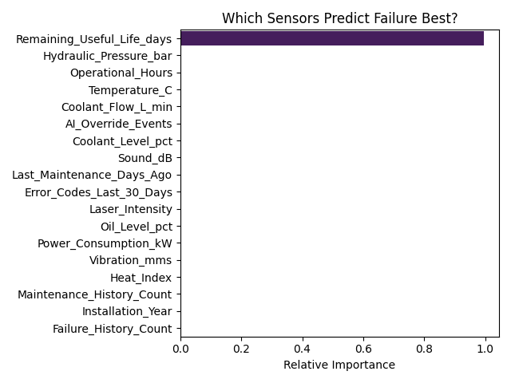
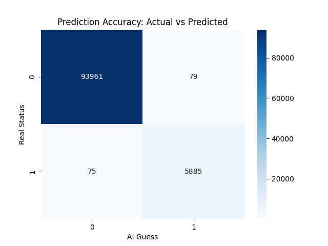

# 🛠️ Machine Failure Predictor
**A Predictive Maintenance system using XGBoost to forecast equipment failure.**

## 📊 Project Overview
This project uses simulated sensor data (Temperature, Vibration, Pressure) to predict whether a machine will fail within the next 7 days. By predicting failures early, factories can save thousands in repair costs and downtime.

## 🚀 Live Demo
[Link to your Streamlit App if deployed]

## 🧠 Model Results
We used an **XGBoost Classifier** to achieve high precision in failure detection.

### Feature Importance
*Which sensors matter most?*

### Confusion Matrix
*How accurate is the model?*

## 📁 Repository Structure
* `app.py`: Streamlit web interface.
* `model_building.ipynb`: Exploratory Data Analysis (EDA) and model tuning.
* `model_building.py`: The production-ready training pipeline.
* `factory_sensor_simulator_2040.csv`: Simulated dataset.
* `*.pkl` & `*.json`: Saved model assets for the web app.

## 🛠️ How to Run Locally
1. Clone the repo: `git clone <your-repo-url>`
2. Create a virtual environment: `python -m venv venv`
3. Install dependencies: `pip install -r requirements.txt`
4. Run the app: `streamlit run app.py`